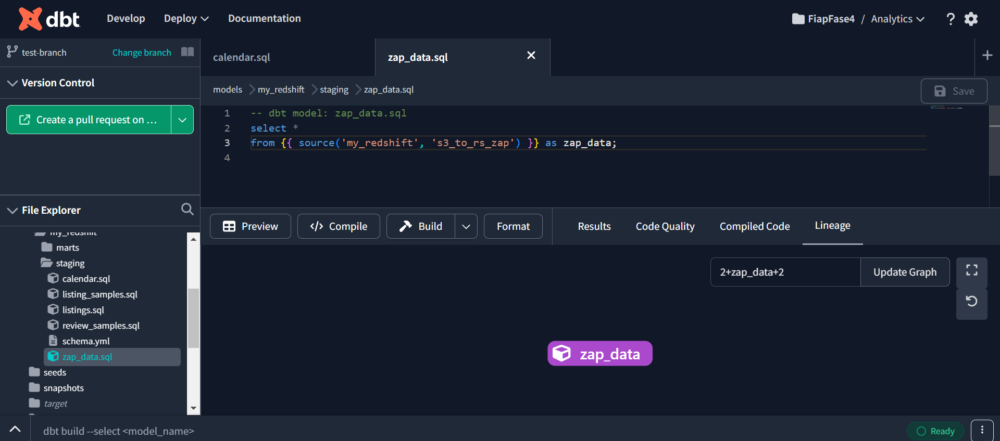
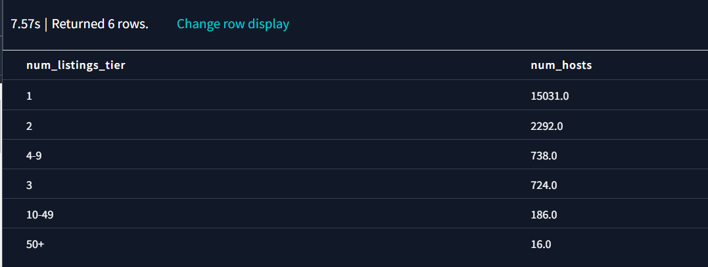
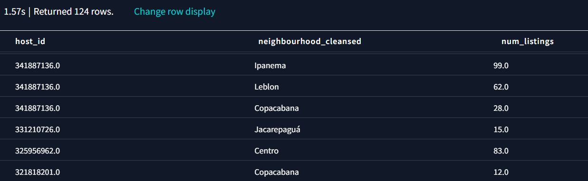

# airbnb-zap-scrapping-ml-mba-fiap
This repository contains the solution for the FIAP - MBA Data Engineering Sprint 4 Challenge.

The 8ABDO - Fase 4 - Solution Sprint.pdf contains the original challenge file with detailed instructions. To summarize, the project goal is to create a Modern Data Stack Platform that uses scrapped data from Airbnb and Zap Imoveis (a Brazilian Real Estate marketplace) to generate insights regarding the Real Estate market in the city of Rio de Janeiro.

In addition to data exploration, this project also aims to create an analytical model to choose the best neighborhood for buying a property, considering the financial return from its estimated Airbnb revenue.

A final pitch presentation that summarizes the content detailed below is available in the presentation folder. 

## Architecture


The image above summarizes the architecture for this project, divided into 3 different layers:

**1 - Batch Layer:** The main goal of this project is to run analysis on top of the batch layer. There are two different datasets used in the project: pre-scrapped data from [insideairbnb.com](http://insideairbnb.com/) and to be scrapped data from Zap Imoveis, using the [PyPi ZapImoveis Scrapper library](https://pypi.org/project/zapimoveis-scraper/). Jupyter Notebooks is used to run the scraping script and store the data in CSV format in Amazon S3, which is then used as the landing zone for the Airbyte ETL tool to make the ingestion into Amazon Redshift. DBT is connected to Redshift to facilitate data modeling and is also leveraged as a data catalog tool for improved data governance. Finally, Metabase is connected to Redshift, so nontechnical users can benefit from a friendly UX to build charts and run exploratory analyses. 

Airflow is included in the architecture for demonstration purposes but was not included in the development of this project due to the non-recurring nature of data changes from the data sources and the low likelihood that weekly or monthly changes would affect the answers to the aforementioned questions. However, in case price fluctuation increases its frequency, we recommend using an orchestrator to run a DAG with tasks to run the Jupyter script to ingest the data, upload it to S3, ingest it into Redshift, and update the Metabase queries.

Airbyte, Airflow, and Metabase were chosen due to their open-source nature so we can provide a low-cost solution. S3 and Redshift were preferred over other cloud data warehouses due to a personal preference of our team but we do understand any other data warehouse could fit in the same architecture without any issues. Finally, DBT was chosen to facilitate data modeling as it has been gaining popularity in the industry and DBT catalog was chosen as the data governance tool so we could simplify the overall stack avoiding including an additional provider.

**2 - Real Time Layer:** This layer is not part of this project's scope of development but a suggested next step for further improvement of the project. As Airbnb data from insideairbnb.com is not updated often, the real state data from Zap Imoveis would be the only dataset to be frequently updated. The same script used in the batch layer is used to scrap data from ZapImoveis and land it into an S3 bucket. Airbyte, therefore, ingests this data into Kafka, and Kafka-Connector is used as a consumer to drive data to Redshift.

**3 - Machine Learning Layer:** Dataiku was chosen to create and deploy the model that can choose the best neighborhood for buying a property, considering the financial return from its estimated Airbnb revenue. Dataiku was chosen due to the fact it provides pre-built algorithms, an easy-to-use user interface, and the possibility to be used in open-source mode for this project.

## Instructions

1. First of all, run the Scrapper - ZapScrapper (PyPi ZapImoveis Scrapper library) or the Scrapper - BeautifulSoup notebook (custom code created using BS4 directly) to get data from Zap Imoveis. The former is easier to use, but the latter is more likely to run to scrape a higher number of pages given recent changes in the ZapImoveis website.

2. Create a user with Administrator access inside your AWS IAM panel and generate the key and secret to fill the aws_template.cfg file. The original aws.cfg file used in this project is not available in the repository as it's being filtered by git ignore.

3. Run the "2. Setup" notebook to create the infrastructure resources in AWS and upload the dataset files to S3 buckets using the aws.cfg data. Depending on the ETL tool of choice, might be worth it to perform basic cleaning in some CSV columns such as removing '$' and ',' characters from numeric values before uploading them to S3. Some examples can be found in the notebook "3. Exploration".

4. Update bucket access from private to public by adding a bucket policy and/or ACLs:

```
{
    "Version": "2012-10-17",
    "Statement": [
        {
            "Effect": "Allow",
            "Principal": "*",
            "Action": [
                "s3:GetObject"
            ],
            "Resource": [
                "arn:aws:s3:::zap-data-landing-fiap/*"
            ]
        }
    ]
}
```


5. Create an account at Airbyte and set up one connection for each bucket, as per the print screens below. Alternatively, it is possible to run it using a script (not available in this project) and the Airbyte modules.

**5.1 Setting up the source**


**5.2 Sync completed**


**5.3 Data inside Redshift**

You can verify that the data has landed correctly inside your redshift by connecting to the database. 

Three tables should have been created, one that represents the CSV columns and 2 that are related to the Airbyte sync process. 


The results of the query can be seen in the image below:


Now, it is necessary to repeat the process to land the data from the other bucket. the ETL is likely to take around an hour to run given the amount of data being loaded.

6. With all the data inside Redshift, it is now possible to work on data modeling with DBT. For this, it is necessary to set up a DBT project and create models to benefit from the DBT functionalities. One of these is to reference the redshift tables as sources instead of using raw SQL to create the views in DBT, making the code more modular and easy to adapt in the future.



7. Finally, it is possible to answer the proposed questions below. The queries for them are located inside the DBT analyses folder referenced by the letters of the questions. Charts for visualizing and interacting with the presentation were created in Metabase and can be viewed inside the final presentation.

**a) How many accommodations are there in a neighborhood and where are they located?**

There are 371 different neighborhood values - including the null values, and Copacabana, Barra da Tijuca, and Ipanema lead the ranking.


**b) How many houses and apartments are frequently being rented to tourists and not to long-term residents?**

The great majority of the listings are for super short-term rentals, with over 90% of the properties being available for rental with the number of minimum nights between 1-5 and almost 99% available for less than 30 nights.


**c) How much do hosts earn from renting to tourists?**

Hosts' earnings can vary based on multiple factors. However, considering the following assumptions:

- median price of $350/night/person
- average number of reviews/month of 1.01
- average "accommodates" of 4, but likely to fill only half of that
- trend previously identified of short stays pointing to weekend stays (2 days) 
- review ratio of 25% (1 out of 4 people that rent an Airbnb leave a review)

We could calculate the average monthly income of a host by:
- Calculating the average rental: 350$ x 2 people x 2 days = $ 1.400
- Calculating the number of rentals/month: 1/0,25 x $ 3.924 = ~ 6.400

This number seems feasible, but can drastically vary based on the assumptions above and specific Airbnb variables.

**d) Which hosts are managing a business with multiple listings and where are they located?**

Almost 80% of the hosts have a single listing, and only 5% have more than 3 listings. 



Investigating the hosts with the highest number of listings, it is possible to identify that all of them concentrate properties in the same or few neighborhoods inside noble city areas. 



**e) What type of accommodation is most common on Airbnb in a specific location?**

For Copacabana, the entire rental unit is by far the most common property type, followed by a private room in the rental unit.


**f) What is the price difference between different types of accommodations?**

As can be observed in the image below, for the neighborhood of Copacabana there is a high variation between the price of different types of accommodations. Going from $53 for a "Shared room in a shipping container" and $78 for a "Shared room in a hostel" to $6.250 for a boat. The entire rental unit, the most common property type has an average price of $1.081. 


**g) What are the most expensive regions to stay in?**

Using the median price instead of the average to avoid outliers and filtering for neighborhoods with more than 10 listings, Joá is by far the most expensive region followed by São Conrado, Alto da Boa Vista, Lagoa, and Leblon.


8. Run cleanup.py to destroy AWS infrastructure and clean up the account.
