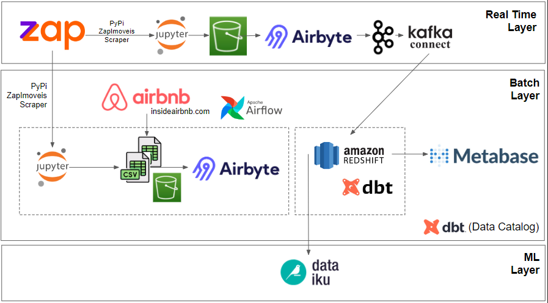
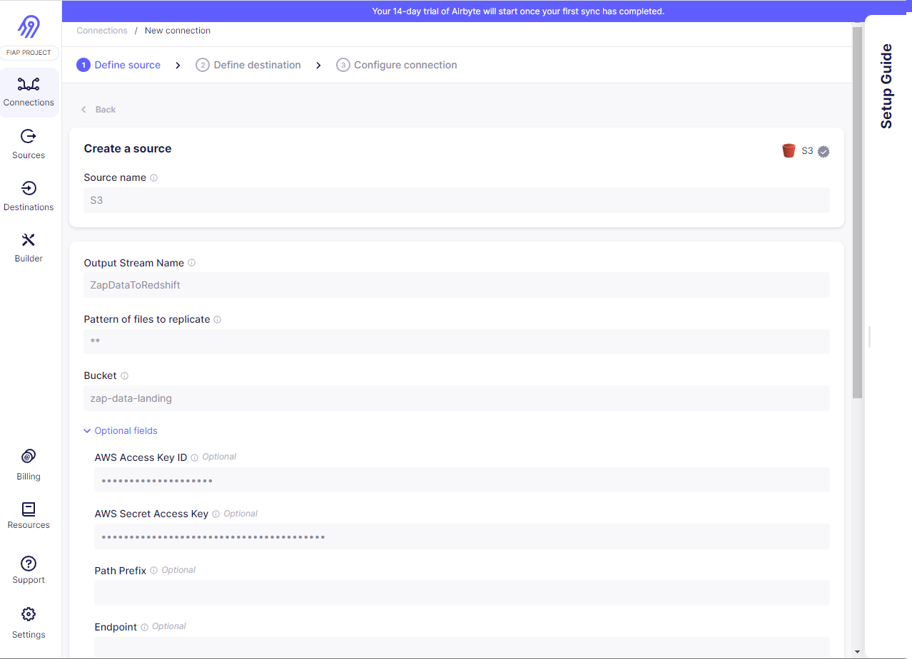
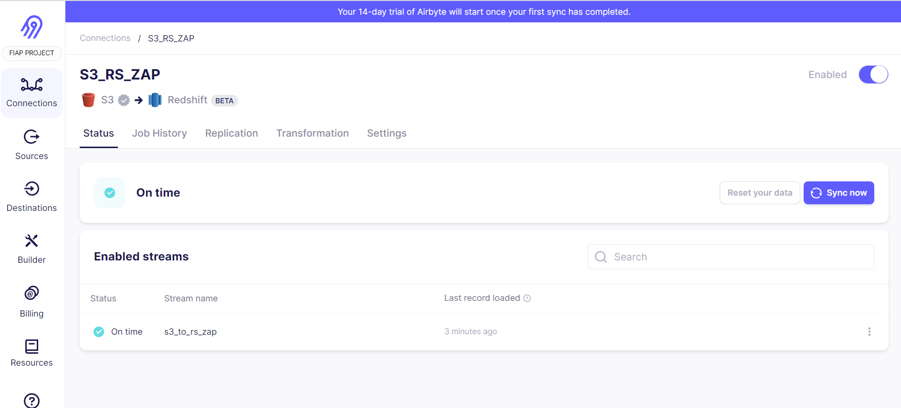
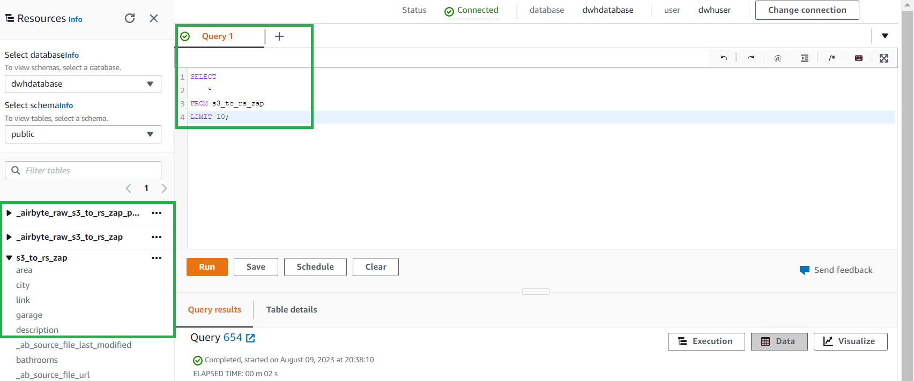
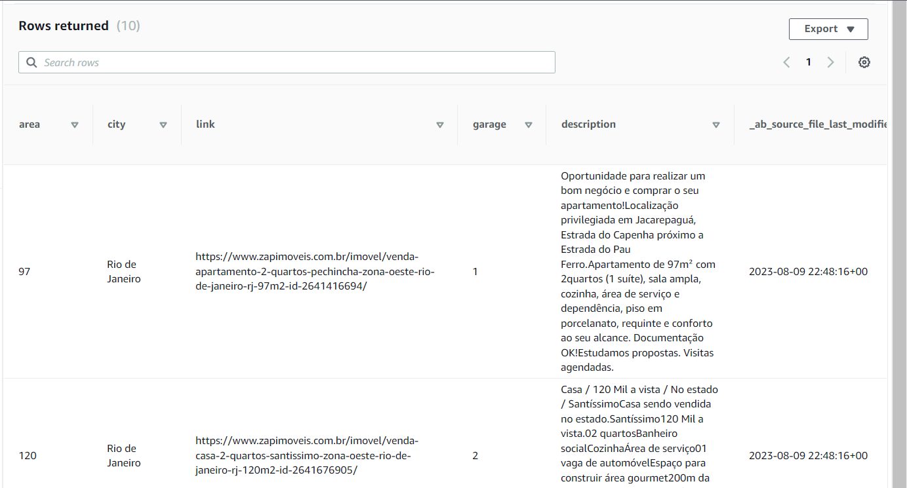
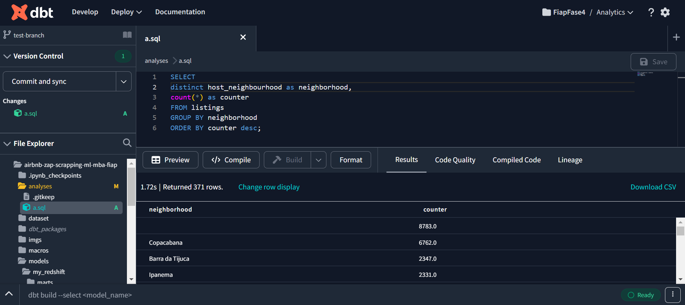
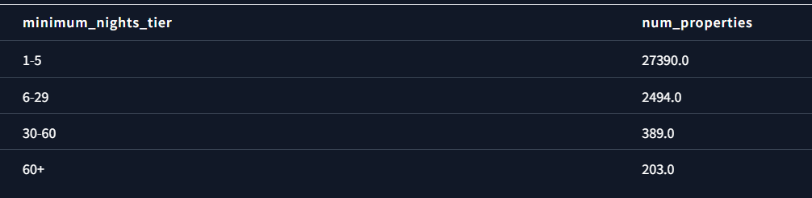
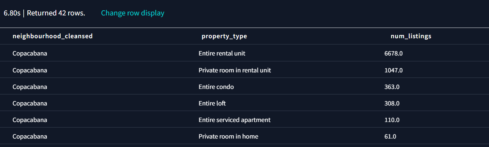
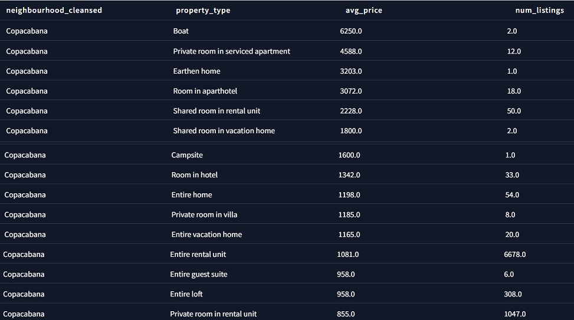
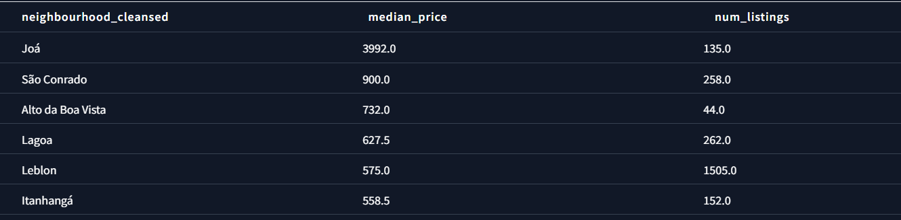

# airbnb-zap-scrapping-ml-mba-fiap
This repository contains the solution for the FIAP - MBA Data Engineering Sprint 4 Challenge.

The 8ABDO - Fase 4 - Solution Sprint.pdf contains the original challenge file with detailed instructions. To summarize, the project goal is to create a Modern Data Stack Platform that uses scrapped data from Airbnb and Zap Imoveis (a brazilian Real State marketplace) to generate insight regarding the Real State market in the city of Rio de Janeiro.

Some possible questions to explore about the data available for Airbnb,
in any neighborhood or in the whole city, are:

1) How many accommodations are there in a neighborhood and where are they located?
2) How many houses and apartments are being rented frequently
for tourists rather than long-term residents?
3) How much do hosts earn from renting to tourists?
4) Which hosts are running a business with multiple listings and
where are?
5) What type of accommodation is most common on Airbnb in a location?
6) What is the price difference between the different types of accommodation?
7) What are the most expensive regions to stay?

Finally, using data both from Airbnb and Zap Imoveis, would it be possible to create an analytical model to choose the best neighborhood for buying a property, considering the financial return from it's estimated Airbnb revenue?

## Architecture



The image above summarizes the architecture for this project, divided in 3 different layers:

**1 - Batch Layer:** The main goal of this project is to run analysis on top of the batch layer. There are two different datasets used in the project: pre-scrapped data from [insideairbnb.com](http://insideairbnb.com/) and to be scrapped data from Zap Imoveis, using the [PyPi ZapImoveis Scrapper library](https://pypi.org/project/zapimoveis-scraper/). Jupyter Notebooks is used to run the scrapping script and store the data in CSV format in Amazon S3, which is then used as the landing zone for the Airbyte ETL tool to make the ingestion into Amazon Redshift. DBT is connected to Redshift to facilitate data modelling and also leveraged as a data catalog tool for improved data governance. Finally, Metabase is connected to Redshift, so non technical users can benefit from a friendly UX to build charts and run exploratory analysis. 

Airflow is included in the architecture for demonstration purposes but was not included in the development of this project due to the non-recurring nature of data changes from the data sources and the low likelihood that weekly or monthly changes would affect the answers to the aforementioned questions. However, in case price flucutation increases it's frequency, we recommend using an orchestrator to run a DAG with tasks to run the jupyter script to ingest the data, upload it to S3, ingest it into Redshift and updating the metabase queries.

Airbyte, Airflow, and Metabase were chosen due to their open source nature so we can provide a low-cost solution. S3 and Redshift was preferred over other cloud data warehouses due to a personal preference of our team but we do understand any other data warehouse could fit in the same architecture without any issues. Finally, DBT was chosen to facilitate data modelling as it has been gaining popularity among the industry and DBT catalog was chosen as the data governance tool so we could simplify the overall stack avoividing to include an additional provider.

**2 - Real Time Layer:** This layer is not part of this project scope of development but a suggested next step for further improvement of the project. As Airbnb data from insideairbnb.com is not updated often, the real state data from Zap Imoveis would be the only dataset to be frequently updated. The same script used in the batch layer is used to scrap data from ZapImoveis and land it into an S3 bucket. Airbyte therefore ingests this data into Kafka, and Kafka-Connector is used as a consumer to drive data to Redshift.

**3 - Machine Learning Layer:** Dataiku was chosen to create and deploy the a model that can choose the best neighborhood for buying a property, considering the financial return from it's estimated Airbnb revenue. Dataiku was chosen due to the fact it provides pre-built algorithms, easy to use user interface, and possibility to be used in open source mode for this project.

## Instructions

1. First of all, run the Scrapper - ZapScrapper (PyPi ZapImoveis Scrapper library) or the Scrapper - BeautifulSoup notebook (ustom code create using BS4 directly) to get data from Zap Imoveis. The former is easier to use, but the later is more likely to run to scrape a higher number of pages given recent changes in the ZapImoveis website.

2. Create a user with Administrator access inside your AWS IAM panel and generate the key and secret to fill the aws_template.cfg file. The original aws.cfg file used in this project is not available in the repository as it's being filtered by git ignore.

3. Run the Setup notebook to create the infrastructure resources in AWS and upload the dataset files to S3 buckets using the aws.cfg data. 

4. Update bucket access from private to public by adding a bucket policy and/or ACLs:

```
{
    "Version": "2012-10-17",
    "Statement": [
        {
            "Effect": "Allow",
            "Principal": "*",
            "Action": [
                "s3:GetObject"
            ],
            "Resource": [
                "arn:aws:s3:::zap-data-landing-fiap/*"
            ]
        }
    ]
}
```


5. Create an account at Airbyte and set up one connection for each bucket, as per the print screens below. Alternatively, it is possible to run it using a script (not available in this project) and the airbyte modules.

**5.1 Setting up the source**


**5.2 Sync completed**


**5.3 Data inside Redshift**

You can verify that the data has landed correctly inside your redshift by connecting to the database created with the credentials use to create it in the aws.cfg file. 

Three tables should have been created, one that represent the CSV columns and 2 that are related to the Airbyte sync process. 



The results of the query can be seen in the image below.



Now, it is necessary to repeat the process to land the data from the other bucket. the ETL is likely to take around an hour to run given the ammount of data being loaded.

6. Finally, with all the data inside Redshift, it is now possible to work on data modelling to answer the questions below.

a) How many accommodations are there in a neighborhood and where are they located?



b) How many houses and apartments are frequently being rented to tourists and not for long-term residents?



c) How much do hosts earn from renting to tourists?


d) Which hosts are managing a business with multiple listings and where are they located?


e) What type of accommodation is most common on Airbnb in a specific location?



f) What is the price difference between different types of accommodations?



g) What are the most expensive regions to stay in?




X. Run cleanup.py to destroy AWS infrastructure and clean up the account.
